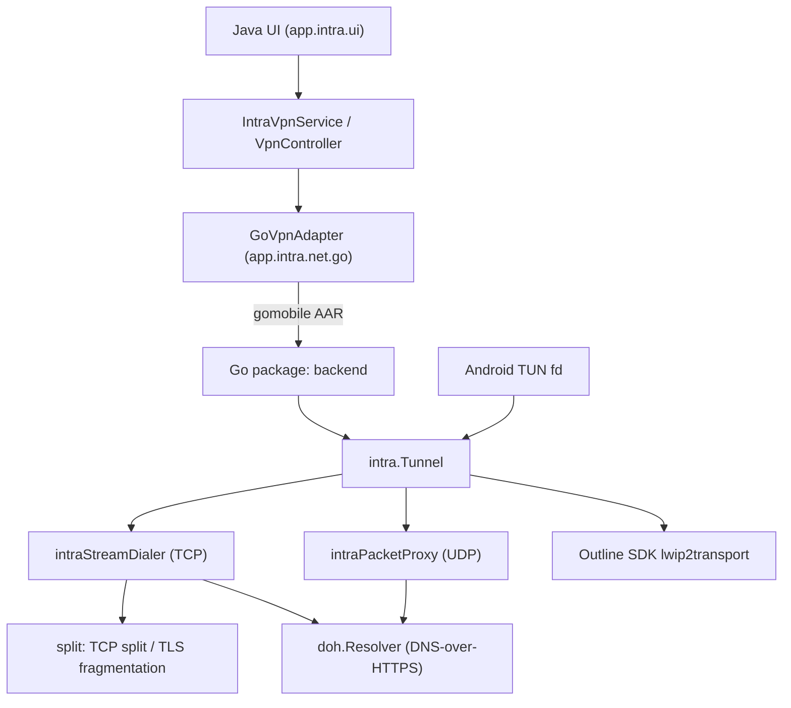

# AGENTS.md

Guidance for AI coding agents working in the Intra repository.

## Project overview

Intra is an Android app (`app.intra`, Google Play) that runs a local VPN to
encrypt DNS lookups via DNS-over-HTTPS (DoH) and to defeat some forms of
network-level TLS blocking (TCP/TLS splitting). It is developed by Jigsaw.

The codebase is a **hybrid Java + Go project**:

- **Java/Android UI and system layer** — `Android/app/src/main/java/app/intra/`
- **Go network backend** — `Android/app/src/go/`, compiled into an `.aar` with
  [`gomobile bind`](https://pkg.go.dev/golang.org/x/mobile/cmd/gomobile) and
  consumed by the Java code as the `backend` / `protect` Java packages.

## Repository layout

```
go.mod                       Go module, named "localhost/Intra" (root of the repo)
tools.go                     Pins gomobile/gobind as tool dependencies (build tag: tools)
scripts/dbip_shrink.py       Helper to shrink the DB-IP country database
.github/workflows/go_test.yml  CI: go test -v -race ./...
Android/
  build.gradle               Root Gradle build (AGP 8.5.1, strict dependency locking)
  gradle.properties          SDK versions: compile/target 35, min 21
  app/build.gradle           App build + custom `compileGoBackend` / `ensureGoMobile` tasks
  app/src/main/java/app/intra/
    net/dns/                 DNS packet parsing (DnsPacket)
    net/doh/                 DoH probing/racing and query Transaction model
    net/go/                  Bridge to the Go backend (GoVpnAdapter, GoIntraListener, GoProber)
    sys/                     VpnService, VpnController, persistent state, tile service
    sys/firebase/            Analytics, Crashlytics, Remote Config wrappers
    ui/                      Activities, fragments, settings, charts
  app/src/main/res/          Layouts + heavily localized strings (many values-* dirs)
  app/src/test/              JVM unit tests (JUnit 4, Mockito)
  app/src/androidTest/       Instrumented tests (androidx.test)
  app/src/go/
    backend/                 gomobile-exported API (Session, DoHServer, listeners)
    intra/                   Core tunnel: stream dialer, packet proxy, TCP/UDP, SNI reporter
    intra/split/             TCP split / TLS fragmentation retrier
    intra/protect/           Wrapper for Android VpnService.protect()
    doh/                     DoH resolver, client auth, padding
    doh/ipmap/               IP address cache per hostname
    tuntap/                  TUN file-descriptor helper
    logging/                 slog-based logging helpers
```

## Architecture



Key flow: `IntraVpnService` establishes the VPN and hands the TUN file
descriptor to `GoVpnAdapter`, which calls `backend.ConnectSession(...)`. The Go
side wraps the fd ([tuntap.MakeTunDeviceFromFD](file:///Users/fortuna/code/Intra/Android/app/src/go/tuntap/tun.go#L24-L38)),
builds an [intra.Tunnel](file:///Users/fortuna/code/Intra/Android/app/src/go/intra/tunnel.go#L41-L50),
and relays packets through the Outline SDK lwIP stack. DNS traffic addressed to
the "fake DNS" address is diverted to the configured `doh.Resolver`; TCP
traffic optionally gets split/fragmented; everything else is forwarded.

## Build and test commands

Go (run from the repository root):

```bash
go build ./...
go vet ./...
go test ./...            # CI runs: go test -v -race ./...
gofmt -l .               # must output nothing
```

Android (run from `Android/`):

```bash
./gradlew assembleDebug          # also triggers ensureGoMobile + compileGoBackend
./gradlew test                   # JVM unit tests
./gradlew connectedAndroidTest   # instrumented tests (needs a device/emulator)
./gradlew check
./gradlew :app:compileGoBackend  # build only the Go AAR
```

> [!IMPORTANT]
> A Go toolchain and the Android SDK/NDK are required for the Gradle build.
> `Android/app/build.gradle` parses the Go version out of the root `go.mod` and
> sets `GOTOOLCHAIN` explicitly, because `gomobile` ignores `go.mod`.

## Conventions and gotchas

- **Module path is `localhost/Intra`.** Internal imports look like
  `localhost/Intra/Android/app/src/go/doh`. Do not "fix" this to a GitHub path.
- **`backend` is the only package the Java code may touch.** See
  [backend/doc.go](file:///Users/fortuna/code/Intra/Android/app/src/go/backend/doc.go).
  There is ongoing work (see TODOs in
  [backend/tunnel.go](file:///Users/fortuna/code/Intra/Android/app/src/go/backend/tunnel.go#L30-L36))
  to stop re-exporting the `intra` package.
- **gomobile type restrictions** apply to anything exported from `backend`:
  only `bool`, numeric types, `string`, `[]byte`, and pointers to exported
  structs / interfaces defined in the bound packages. No slices of strings, no
  maps, no generics. Existing code works around this (e.g. `NewDoHServer` takes
  a comma-separated `ipsStr` instead of `[]string`).
- **Only these Go packages are bound:** `backend`, `intra`, `intra/split`,
  `intra/protect` (see `goSourcePackages` in `Android/app/build.gradle`). Adding
  a new package that Java must see requires updating that list.
- **Logging:** use the `logging` package (`logging.Debug`, `logging.Debugf`,
  …), not `log` or `fmt.Print`. The `*f` variants skip formatting when the level
  is disabled. Java code uses `app.intra.sys.firebase.LogWrapper`.
- **Memory:** `backend/init.go` sets `debug.SetGCPercent(10)` on purpose —
  mobile memory pressure. Be conservative with allocations on the data path.
- **Socket protection:** any Go code that opens an external socket must go
  through `protect.MakeDialer` / `protect.MakeListenConfig`, otherwise traffic
  loops back into the VPN.
- **Concurrency:** the tunnel is heavily concurrent; swappable resolvers use
  `atomic.Pointer`. CI runs with `-race`; keep it clean.
- **License header:** every new Go and Java file starts with the Apache 2.0
  header ("Copyright <year> Jigsaw Operations LLC").
- **Java style:** 2-space indent, Java 8 source/target level, AndroidX.
- **Dependency locking is STRICT.** Changing Gradle dependencies requires
  regenerating lockfiles (`./gradlew ... --write-locks`).
- **Localization:** `res/values/strings.xml` is the source of truth; translated
  `values-*` directories are managed externally — do not hand-edit them.
- **Firebase** is enabled only in release builds (`FIREBASE_ENABLED` resource
  bool). `google-services.json` is checked in; release signing needs an
  untracked `Android/keystore.properties`.

## Commit and PR conventions

Commit messages follow Conventional Commits with an optional scope, e.g.:

```
fix: skip zero-len writes in split retrier (#519)
build(deps): upgrade Outline SDK to v0.0.23 (#605)
doh: use tls session cache
```

All changes go through GitHub pull requests against `master` and require review
(see [CONTRIBUTING.md](file:///Users/fortuna/code/Intra/CONTRIBUTING.md); a
Google CLA is required).

## Checklist before finishing a change

1. `gofmt -l .` is empty and `go vet ./...` passes.
2. `go test -race ./...` passes from the repo root.
3. If Java/resources changed: `cd Android && ./gradlew assembleDebug test`.
4. If the `backend` API changed: confirm the callers in
   `Android/app/src/main/java/app/intra/net/go/` still compile, and that the
   new signatures are gomobile-compatible.
5. New files carry the Apache 2.0 license header.
